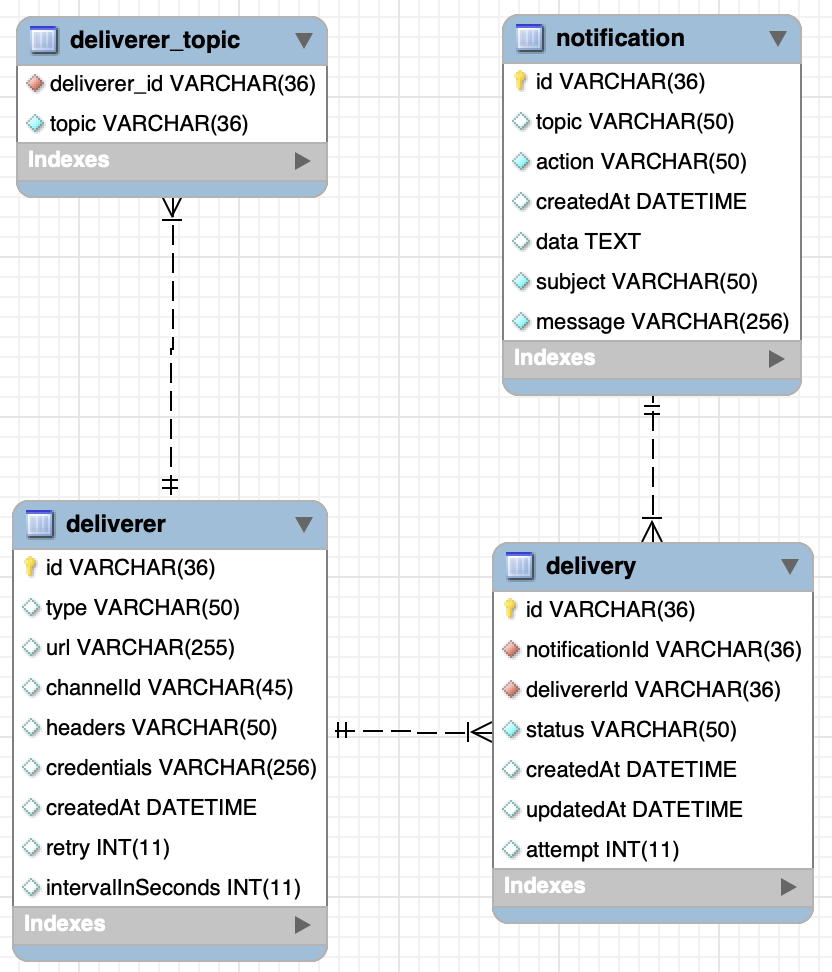

# Notifier

Notifier is a GO library for sending notifications to external messaging applications on demand. For example, when an
event occurs on a topic in an application, if you want that event to be sent as a notification to external services
(such as slack or webhooks) which have subscribed to, this library will take care of it.

### Model



### Usage

```shell
go get -u github.com/vithubati/go-notifier
```

## Inserting notification

```go
nService, err := New(&config.Config{
    Notifier: config.Notifier{
        Webhook:          true,
        Slack:            true,
        ConnString:       "root:password@/notifier?parseTime=true",
        DeliveryInterval: 5 * time.Second,
        Migrations:       true,
    },
    Trace:         false,
    JsonLogFormat: true,
})
if err != nil {
    log.Fatalln(err)
}
n := model.Notification{
    Topic:   "SERVER",
    Action:  "CREATE",
    Subject: "SERVER Created",
    Message: "Server is created for the accountId G445",
}
if err := nService.CreateNotification(context.Background(), n); err != nil {
    log.Fatalln(err)
}
```

## Inserting deliverer (Slack/Webhook)

```go
nService, err := New(&config.Config{
    Notifier: config.Notifier{
        Webhook:          true,
        Slack:            true,
        ConnString:       "root:password@/notifier?parseTime=true",
        DeliveryInterval: 5 * time.Second,
        Migrations:       true,
    },
    Trace:         false,
    JsonLogFormat: true,
})
if err != nil {
    log.Fatalln(err)
}
d := model.Deliverer{
    Type:              "WEBHOOK",
    Url:               "https://www.stackoverflow.com/ttest",
    Retry:             3,
    IntervalInSeconds: 10,
    Topics:            []model.DelivererTopic{{Topic: "SERVER"}},
}
headers := make(map[string][]string)
headers["X-Request-id"] = []string{"456456"}
d.Headers = headers
if err := nService.CreateDeliverer(context.Background(), d); err != nil {
    log.Fatalln(err)
}
```

## Initiating the Notifier service worker

```go
package main

import (
	"context"
	"database/sql"
	"github.com/vithubati/go-notifier/config"
	"github.com/vithubati/go-notifier/service"
	"log"
	"net"
	"net/http"
	"sync"
	"time"
)

func main() {
	ctx, cancel := context.WithCancel(context.Background())
	defer cancel()
	var wg sync.WaitGroup
	wg.Add(1)
	go func() {
		db, err := sql.Open("mysql", "root:password@/notifier?parseTime=true")
		if err != nil {
			log.Fatalf("failed to open db error = %v", err)
			return
		}
		defer db.Close()
		cfg := newConfig()
		cfg.Notifier.Client = httpClient()
		s, err := service.New(db, cfg)
		if err != nil {
			log.Fatalf("Notifier() error = %v", err)
			return
		}
		if err := s.KickOff(ctx); err != nil {
			log.Fatalf("Notifier() KickOff error = %v", err)
			return
		}
		return
	}()
	wg.Wait()
}

func newConfig() *config.Config {
	return &config.Config{
		Notifier: config.Notifier{
			Webhook:          true,
			Slack:            true,
			DeliveryInterval: 5 * time.Second,
			Migrations:       true,
		},
		Trace:         false,
		JsonLogFormat: true,
	}
}

func httpClient() *http.Client {
	var netTransport = &http.Transport{
		DialContext: (&net.Dialer{
			Timeout: 5 * time.Second,
		}).DialContext,
		TLSHandshakeTimeout: 5 * time.Second,
	}
	return &http.Client{
		Timeout:   time.Second * 10,
		Transport: netTransport,
	}
}

````

### To do

* [ ]  Webhook credentials support
* [ ]  Postgre support
